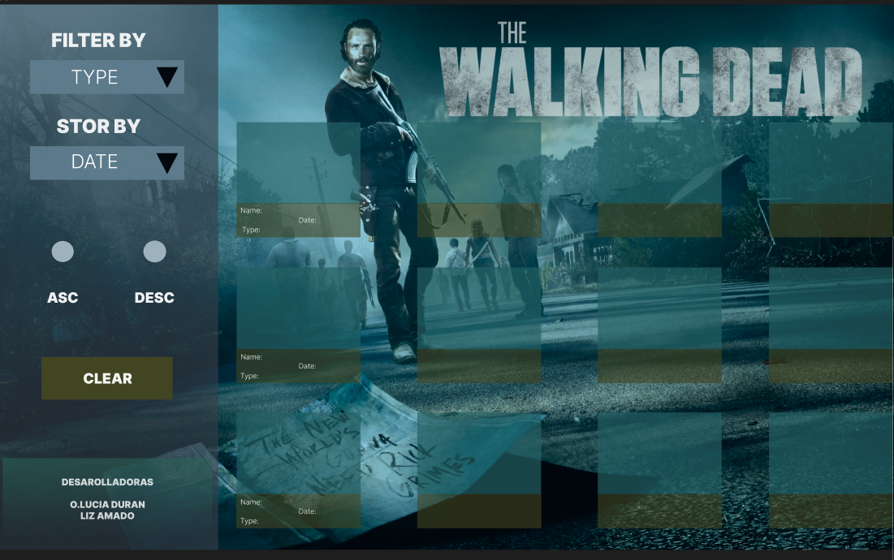
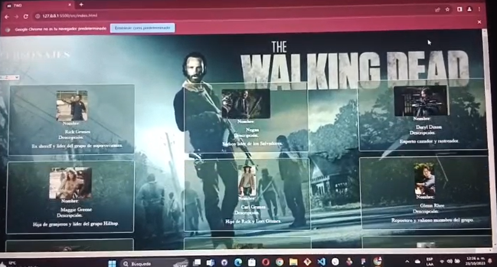
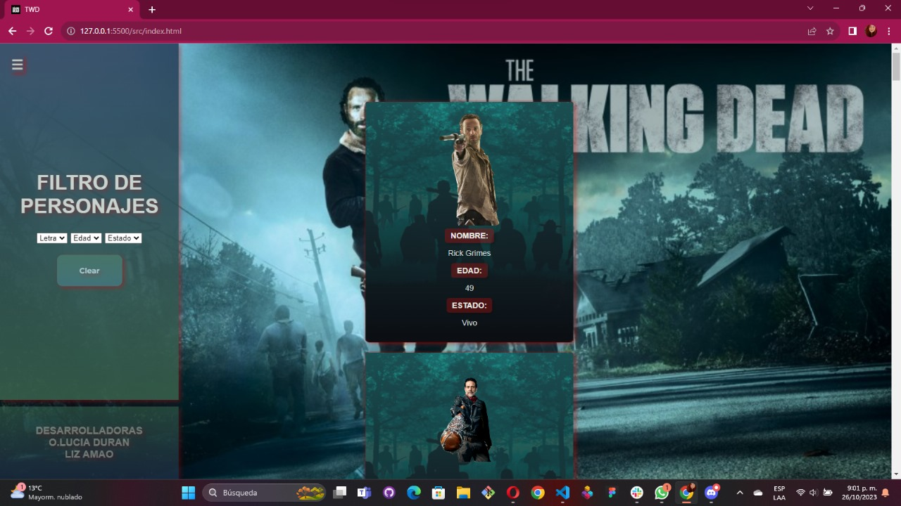
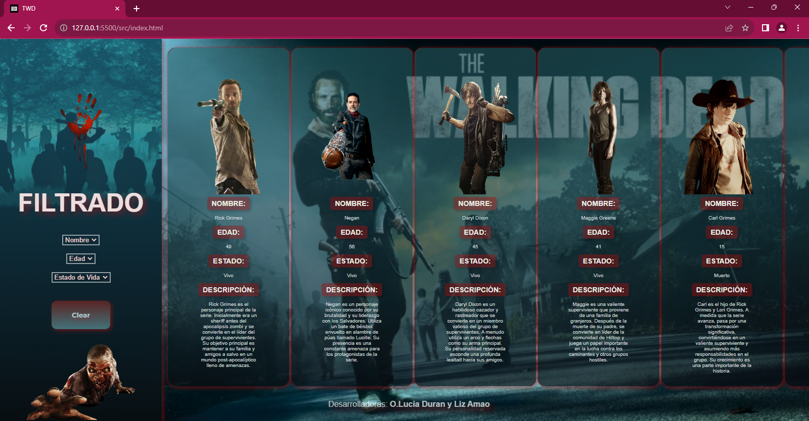
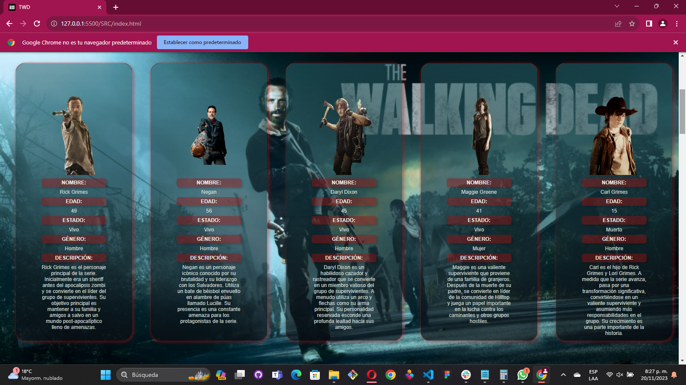
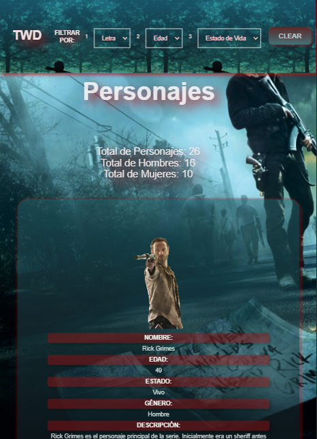

# Dataverse

## Índice

* [1. Preámbulo](#1-preámbulo)
* [2. Resumen del proyecto](#2-resumen-del-proyecto)
* [3. Consideraciones técnicas](#5-consideraciones-técnicas)
  [4. Prototipos de Diseño](#4-prototipos-de-Diseño)
  [5. Diseños Finales (WEB y Movil)](#4-Diseños-Finales)

***

## 1. Preámbulo

Según [Forbes](https://www.forbes.com/sites/bernardmarr/2018/05/21/how-much-data-do-we-create-every-day-the-mind-blowing-stats-everyone-should-read),
el 90% de la data que existe hoy ha sido creada durante los últimos dos años.
Cada día generamos 2.5 millones de terabytes de datos, una cifra sin
precedentes.

No obstante, los datos por sí mismos son de poca utilidad. Para que esas
grandes cantidades de datos se conviertan en **información** fácil de leer para
las usuarias, necesitamos entender y procesar estos datos. Una manera simple de
hacerlo es creando _interfaces_ y _visualizaciones_.

En la siguiente imagen, podrás ver cómo con la data que que se ve en la parte
izquierda se puede construir una interfaz amigable y entendible por las
usuarias, al lado derecho.

## 2. Resumen del proyecto

En este proyecto **construirás una _página web_ para visualizar un
_conjunto (set) de datos_** que vas a generar con [prompting](https://www.itmadrid.com/que-es-un-prompt-en-inteligencia-artificial-ia/).
Esta página web se adecuará a lo que descubras que tu usuaria
necesita.

Además, en este proyecto utilizarás herramientas de
[inteligencia artificial](https://es.wikipedia.org/wiki/Inteligencia_artificial)
como [ChatGPT](https://openai.com/chatgpt), [ExplainDev](https://explain.dev/),
entre otras para generar un set de datos en un archivo javascript.

Este proyecto esta organizado por 26 personajes que se pueden filtrar por 3 opciones diferentes las cuales son acumulables, este tambien dispone de un botos "CLEAR" con el cual se puede resetear con cada filtrado se desee el usuario.

El primer filtro es por letra, con este puedes encontrar dos opciones sea A-Z o Z-A.

El segundo filtro esta por edad, con este puedes contrar dos opciones sea de 0-70 o 70-0.

El terce filtro esta por estado de vida, con este puedes encontrar dos opnciones sea vivo o muerto.

Asi mismo dentro de cada caja encontraras, su imagen, nombre, edad, estado, una pequeña descripcion y su genero. Tambien podras ver una pequeña estadistica de 3 datos la cantidad de personajes al igual que su estadistica dividida por genero masculino y femenino.

Esperamos les guste la tematica fue un tema que encontramos sobre nuestros gustos en comun.

## 3. Consideraciones técnicas

La lógica del proyecto debe estar implementada completamente en JavaScript
(ES6), HTML y CSS. En este proyecto NO está permitido usar librerías o
frameworks, solo [vanilla JavaScript](https://medium.com/laboratoria-how-to/vanillajs-vs-jquery-31e623bbd46e),
con la excepción de librerías para hacer gráficas (charts); ver
[_Parte opcional_](#7-hacker-edition) más arriba.

El _boilerplate_ contiene una estructura de archivos como punto de partida así
como toda la configuración de dependencias:

```text
.
├── README.md
├── package.json
├── src
|  ├── data 
|  |  └── dataset.js (La que hayas generado con la IA)
|  ├── dataFunctions.js
|  ├── view.js
|  ├── index.html
|  ├── main.js
|  └── style.css
└── test
   └── data.js
   └── dataFunctions.spec.js
   └── tests-read-only

```

### `src/index.html`

Como en el proyecto anterior, existe un archivo `index.html`. Como ya sabes,
acá va la página que se mostrará a la usuaria. También nos sirve para indicar
qué scripts se usarán y unir todo lo que hemos hecho.

### `src/main.js`

Recomendamos usar `src/main.js` para todo tu código que tenga que ver con
mostrar los datos en la pantalla. Con esto nos referimos básicamente a la
interacción con el DOM. Operaciones como creación de nodos, registro de
manejadores de eventos (_event listeners_ o _event handlers_).

Esta no es la única forma de dividir tu código, puedes usar más archivos y
carpetas, siempre y cuando la estructura sea clara para tus compañeras.

En este archivo encontrarás una serie de _imports_ listos para _cargar_
las diferentes fuentes de datos.

Por ejemplo, lost datos con los que vas a trabajar,
los encontrarás en la siguiente línea:

```js
import data from './data/dataset.js';
```

### `src/dataFunctions.js`

El corazón de este proyecto es la manipulación de datos a través de arreglos
y objetos.

Este archivo va a contener toda la funcionalidad que corresponda
a obtener, procesar y manipular datos (tus funciones). Por ejemplo:

* `filterData(data, filterBy, value)`: esta función recibe tres parámetros.
  El primer parámetro, `data`, nos entrega los datos.
  El segundo parámetro, `filterBy`, nos dice con respecto a cuál de los campos de
  la data se quiere filtrar.
  El tercer parámetro, `value`, indica el valor de campo que queremos filtrar.

* `sortData(data, sortBy, sortOrder)`: esta función `sort` u ordenar
  recibe tres parámetros.
  El primer parámetro, `data`, nos entrega los datos.
  El segundo parámetro, `sortBy`, nos dice con respecto a cuál de los campos de
  la data se quiere ordenar.
  El tercer parámetro, `sortOrder`, indica si se quiere ordenar de manera
  ascendente o descendente.

* `computeStats(data)`: la función `compute` o calcular, nos permitirá hacer
  cálculos estadísticos básicos para ser mostrados de acuerdo a la data
  proporcionada, esta función debe usar el método reduce.

Estas funciones deben ser [_puras_](https://medium.com/laboratoria-developers/introducci%C3%B3n-a-la-programaci%C3%B3n-funcional-en-javascript-parte-2-funciones-puras-b99e08c2895d)
e independientes del DOM. Estas funciones serán después usadas desde el archivo
`src/main.js`, al cargar la página, y cada vez que la usuaria interactúe
(click, filtrado, ordenado, ...).

### `src/data`

En esta carpeta están los datos con los que vas a trabajar (los datos de ejemplo
o los datos que generarías con ayuda de la inteligencia artificial).

### `test/dataFunctions.spec.js`

En este archivo tendrás hacer pruebas unitarias de las funciones
implementadas en el archivo `dataFunctions.js`. (`filterBy`, `sortBy`, etc.)

### `test/data.js`

En esta archivo puedes construir y exportar data "mock" para usar en los tests.
Es mas fácil probar un arreglo de 5 elementos de un arreglo de 24, por eso
vas a crear una muestra de la data que quieres probar. Como mínimo
debes exportar un variable se llama `data`, pero puedes definir y exportar mas
si sea necesario para tus tests.

### `src/view.js`

Para alcanzar mejor separación de responsabilidades en el código este
archivo debe tener todas las funciones que utilizara para renderizar
los elementos dinámicamente.

Al menos se requeriere una función obligatoria:

* `renderItems(data)`: esta función recibe el arreglo de data para renderizar
  los elementos de cada item, y debería volver un elemento DOM o
  un string de HTML.

## 4. Prototipos de Diseño

### Prototipo FIGMA



### Prototipo en Desarrollo Version WEB

### 1



### 2



### 3



### Prototipo Movil FIGMA


## 5. Diseños Finales (WEB y Movil)

#### WEB

## Menu y Estadisticas


## Personajes




#### MOVIL

